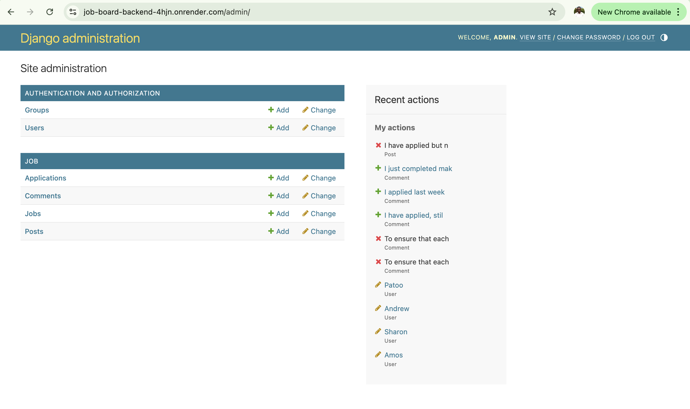
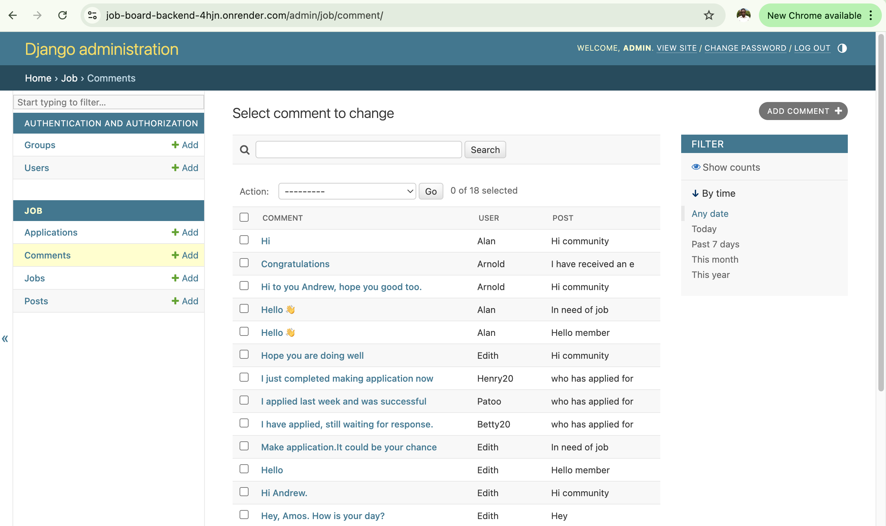
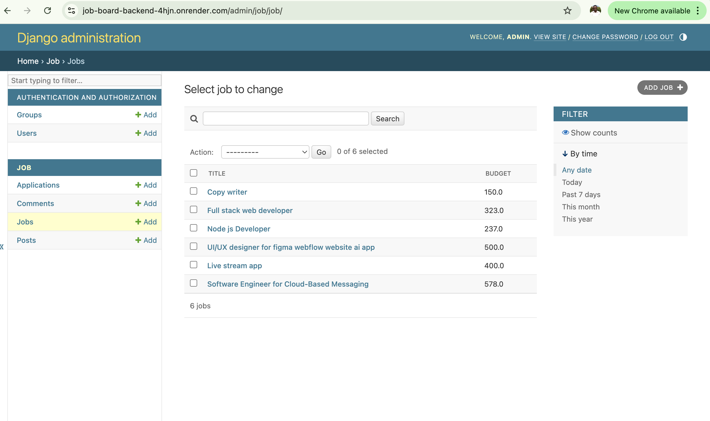
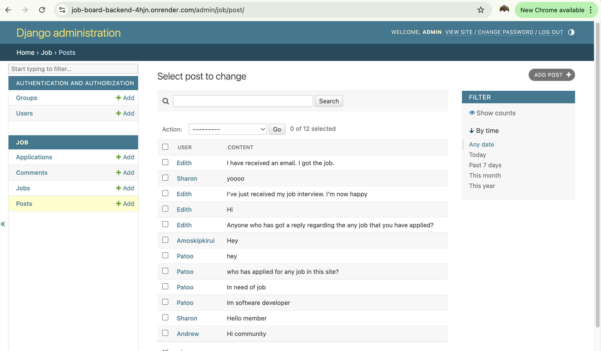

# Job Posting and Community API

A Django-powered API that enables job postings and includes a community section where users can chat. This API is designed for a robust job board platform, with built-in authentication, job management, and chat features for user interaction.

## Features

- **Job Posting**: Users can create, view, update, and delete job postings.
- **Community Section**: Real-time chat feature for users to connect and discuss.
- **User Authentication**: Registration, login, and profile management.
- **Admin Management**: Admin access for managing posts and community guidelines.

## Requirements

- Python 3.x
- Django
- Django Rest Framework
- Channels for real-time chat (if using WebSocket for the community section)
- SQLite or PostgreSQL for database management
- Additional libraries as specified in `requirements.txt`

## Installation

1. Clone the repository:
   ```bash
   git clone https://github.com/yourusername/yourproject.git
   cd yourproject








